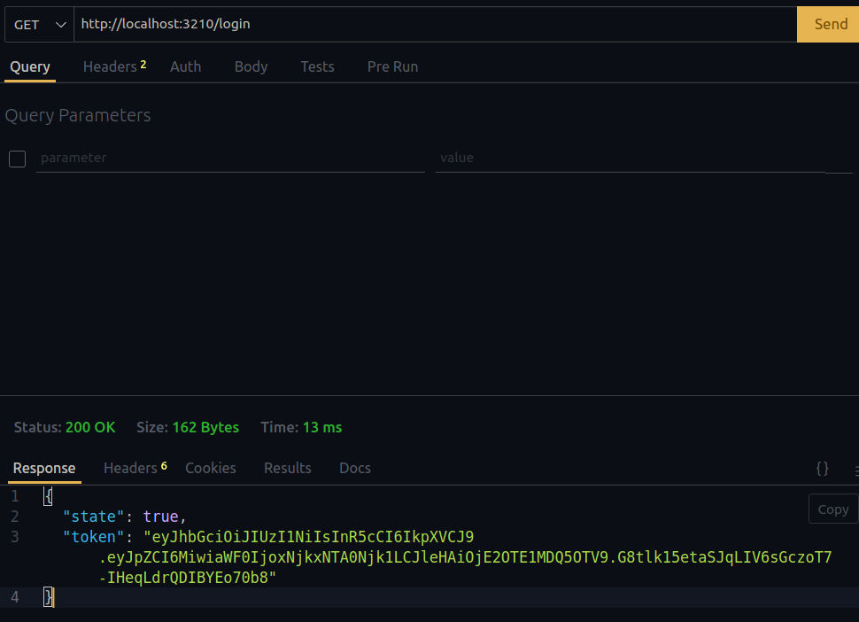
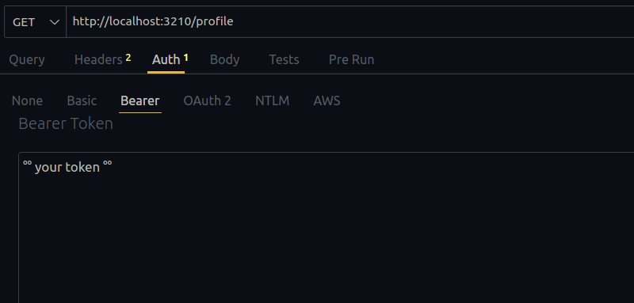

## Passport-http-bearer

information official: 

***"The passport-http-bearer module provides a Passport strategy for authenticating bearer tokens used in accordance with the HTTP Bearer authentication scheme.***

***Bearer tokens are a credential which can be used by any party in possession of the token to gain access to a protected resource. Use of a bearer token does not require any additional credentials, such as a cryptographic key. As such, bearer tokens must be protected from disclosure in both storage and transport in order to be utilized securely.***

***The Bearer authentication scheme is specified by RFC 6750. This scheme was designed for use with access tokens issued using OAuth 2.0. However, this scheme is useable within the general HTTP Authentication framework (RFC 7235) and can be utilized to authenticate bearer tokens issued via other mechanisms as well."***

## Initialize project 

- Clone the repository and enter the directory

```bash
> git clone https://github.com/TheHackBoxCampus/autenticacion_2_pasos_bearer.git

> cd autenticacion_2_pasos_bearer 
```

### Server 

- listen server 

```js
import app from "./app.js";
import globalProperties from "./env/env.js";

const start = () => {
  try {
    const $SERVER = JSON.parse(globalProperties.SERVER); 
    app.listen($SERVER, () => {
        console.log(`listening http://${$SERVER.hostname}:${$SERVER.port}`)
    })
  } catch (error) {
    throw Error(error);
  }
};

start(); 
```


### Enviroments 

- fill in the fields '...'
- port is number

```txt
SERVER={"hostname": '...', "port": '...'}
KEY="..."
```

## Rutes and const APP 

```js 
import express from "express"; 
import morgan from "morgan";
import auth from "./router/auth.js";
import passport from "passport";

const app = express(); 
/**
 * ! middlewares
 */
app.use(express.json());
app.use(express.text()); 
app.use(morgan("dev"))
app.use(passport.initialize()); 

/**
 *  * Routes 
 */

app.use(auth); 

export default app; 
```

### Install the libraries 

- morgan 
- express
- passport 
- passport-http-bearer
- dotenv
- jsonwebtoken
- nodemon


```bash
> npm i || npm install 
```

### Uses 

### - Morgan

information official: 

***"Morgan: Morgan is an HTTP request level Middleware. It is a great tool that logs the requests along with some other information depending upon its configuration and the preset used. It proves to be very helpful while debugging and also if you want to create Log files."***

#### Examples

- Install 

```bash 
npm i -E morgan
```

- import 


```js
import morgan from "morgan" // es6
const morgan = require("morgan") // commond.js
```

- insert middleware

```js
// example.js || your server file

import morgan from "morgan" // es6
import express from "express" 

const app = express(); 

/**
 * ! middlewares
 */
app.use(express.json())
app.use(express.text())
app.use(morgan("dev")) // mode dev => detect HTTP requests

```


### - passport-http-bearer

- install 

```bash
npm i -E passport-http-bearer
```

- import 
```js
import {Strategy as BearerStrategy} from "passport-http-bearer"

```
- generic example
 
```js
new BearerStrategy(function(token, cb) {
  tokens.findOne({ value: token }, function(err, claims) {
    if (err) { return cb(err); }
    if (!claims) { return cb(null, false); }

    users.findOne({ id: claims.userID }, function (err, user) {
      if (err) { return cb(err); }
      if (!user) { return cb(null, false); }
      return cb(null, user, { scope: claims.scope });
    });
  });
});
```

## functioning

Main url = http://${hostname:port/**rute**/}$

- **Rutes**: 

```txt
GET -> /login
```
- you do not need to enter data


- the endpoint generates a token in a json



#### what to do with that token? 

- copy the token. CRT+C or copy

- when you query the ``profile`` route you will need to enter that token that you copied into the bearer of the query header, otherwise you will not be able to access the content

**STEPS**: 


```txt
GET -> /profile
```
- follow the previous steps, for the use of the token

- once the token is registered, you will receive the authenticated message, otherwise a 401unauthorized exception

## Contact 

Name: Miller Kaled Nariño Ibarra

email: kalednarino@gmail.com || millercampusdeveloper@gmail.com 

## Resources in web 

json-web-token | authorization = https://carlosazaustre.es/autenticacion-con-token-en-node-js

passport = https://antoniofernandez.com/api-node-autenticacion-tokens/